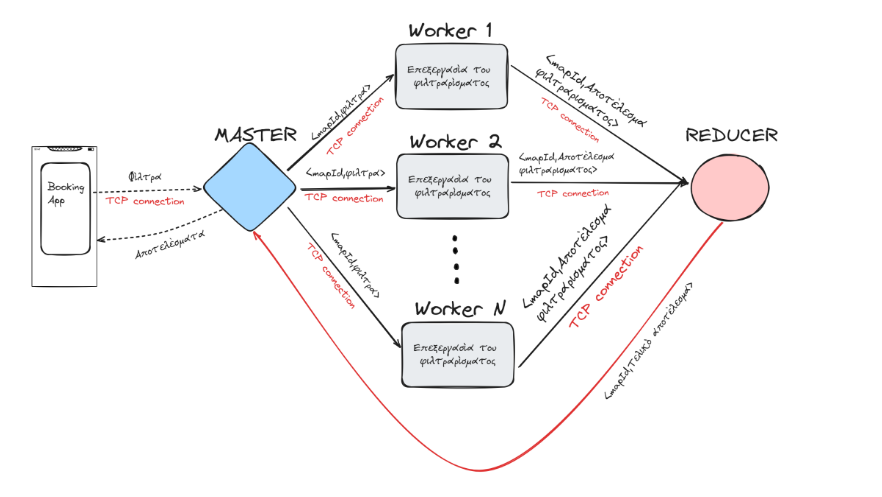

# Distributed Booking Platform (MapReduce)

Distributed booking platform developed as part of a university **Distributed Systems** project.
The system follows a **Master–Worker** architecture and applies **MapReduce-style** processing
to support scalable search and filtering of room listings.

## Overview
The application allows hosts to publish room listings and availability, while users can search,
filter and submit booking requests. Client requests are distributed across worker nodes, which
process data in parallel and return aggregated results to the coordinator.

## Features
- Hosts publish room listings and availability
- Users search and filter listings (e.g., area, dates, price, capacity)
- Booking request workflow with concurrency handling
- Client–server communication via TCP sockets
- Multithreaded backend for handling multiple requests
- Simple user interface implemented in Java for client interactions

## Architecture
The system is based on a distributed **Master–Worker** model.
The coordinator assigns tasks to worker nodes, which process data in parallel and return
aggregated results. Clients interact with the system through a Java-based interface.

## Tech Stack
- Java
- Gradle
- TCP Sockets
- Multithreading
- Distributed Systems / MapReduce concepts

## How to Run (high level)
1. Start the master/coordinator node
2. Start worker nodes
3. Run client applications to publish, search or book listings

## What I Learned
- Designing distributed workflows using a Master–Worker architecture
- Applying MapReduce ideas to scalable query processing
- Handling concurrency and parallel execution in Java
- Writing maintainable and structured backend-oriented code

